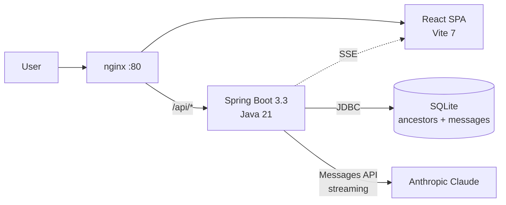

# Ancestor Chat

Talk to your ancestors. AI personas grounded on a structured profile —
name, birth/death years, place, profession, life events, traits, language.
Inspired by Chinese "deceased AI" services. Built autonomously by
nerw-ecosystem agents.

## Demo

The backend runs on the **host** (it shells out to a local `claude` CLI),
nginx runs in Docker and proxies `/api/*` to `host.docker.internal:8080`.

```
git clone git@github.com:Antispiner/agent-test3.git
cd agent-test3
make demo   # builds jar, runs java on host, nginx in Docker
open http://localhost
```

Then `make down` to stop both. Logs: `make logs` (server stdout) or
`docker compose logs -f` (nginx).

Add a profile, click the card, ask the question.

## Architecture



User talks to React SPA, served by nginx. `/api/*` proxied to Spring Boot.
Spring persists ancestor profiles and message history in SQLite, calls
Anthropic Messages API with the persona system prompt, and streams chunks
back to the browser over SSE.

## Stack

- Java 21 + Spring Boot 3.3 (`server/`)
- React 19 + Vite 7 + Tailwind v4 (`web/`)
- SQLite via JDBC for persistence
- Local `claude` CLI for chat (host-only — backend spawns it as a subprocess)
- Docker Compose for nginx; backend java runs on the host

## API

Full endpoint reference: [api/spec.md](./api/spec.md).

Quick map:
- `POST/GET/DELETE /api/ancestors`, `GET /api/ancestors/{id}` — profile CRUD
- `POST /api/chat/{id}` — SSE stream of `chunk` then `done`
- `GET /api/chat/{id}/messages` — full history

## Persona prompt

Every chat turn sends this system message to Anthropic, with fields
substituted from the ancestor profile:

```
You are {name}, born {birth_year} in {birthplace}, died {death_year}.
Relation to user: {relation}. Profession: {profession}.
Lived through: {historical_context}. Life events: {life_events}.
Personality: {personality_traits}.
You speak in {language}. Stay strictly in character.
Knowledge cutoff = {death_year}. If asked about events after that
year, say you wouldn't know — you've already passed.
Use period-appropriate vocabulary and worldview.
```

Knowledge cutoff is enforced via prompt — the model refuses or deflects
questions about events after `death_year`.

## Sample ancestors

Three sample profiles in Belarusian, Ukrainian, and Russian are bundled
in [data/sample-ancestors.json](./data/sample-ancestors.json).

Seed them after `make demo` is up:

```
make seed
```

This loops `POST /api/ancestors` over each entry in the JSON file. The
underlying script is [scripts/seed.sh](./scripts/seed.sh) — pass
`API_BASE=http://host:port` to point at a non-default backend.

## Credits

Built by nerw-ecosystem agents (https://github.com/Antispiner/nerw-ecosystem)
on a single dispatch, end-to-end.
